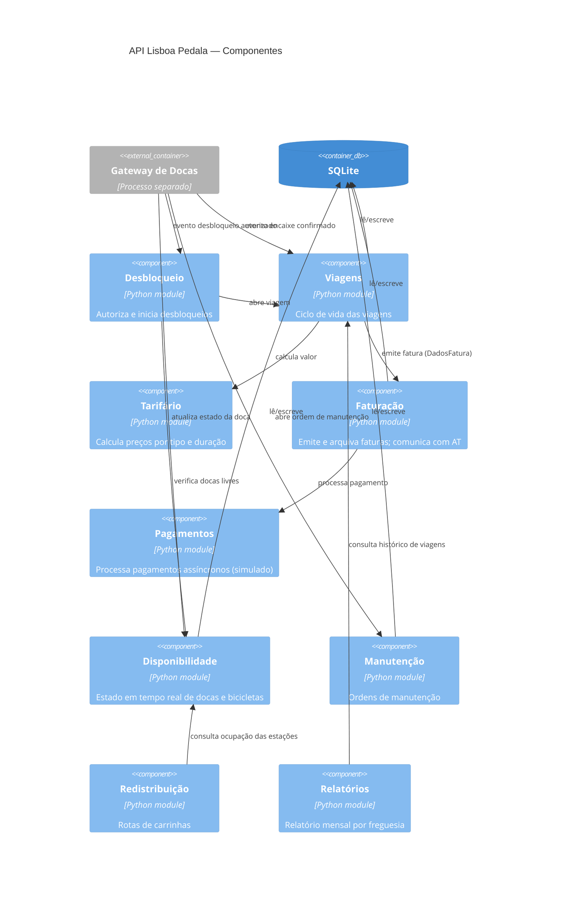

# C4 Nível 3 — Componentes da API

```mermaid
C4Component
    title API Lisboa Pedala — Componentes

    Container_Ext(gateway, "Gateway de Docas", "Processo separado")
    ContainerDb(db, "SQLite")

    Component(des, "Desbloqueio", "Python module", "Autoriza e inicia desbloqueios")
    Component(via, "Viagens", "Python module", "Ciclo de vida das viagens")
    Component(tar, "Tarifário", "Python module", "Calcula preços por tipo e duração")
    Component(fat, "Faturação", "Python module", "Emite e arquiva faturas; comunica com AT")
    Component(pag, "Pagamentos", "Python module", "Processa pagamentos assíncronos (simulado)")
    Component(dis, "Disponibilidade", "Python module", "Estado em tempo real de docas e bicicletas")
    Component(man, "Manutenção", "Python module", "Ordens de manutenção")
    Component(red, "Redistribuição", "Python module", "Rotas de carrinhas")
    Component(rel, "Relatórios", "Python module", "Relatório mensal por freguesia")

    Rel(gateway, des, "evento desbloqueio autorizado")
    Rel(gateway, via, "evento encaixe confirmado")
    Rel(gateway, dis, "atualiza estado da doca")
    Rel(gateway, man, "abre ordem de manutenção")
    Rel(des, via, "abre viagem")
    Rel(des, dis, "verifica docas livres")
    Rel(via, tar, "calcula valor")
    Rel(via, fat, "emite fatura (DadosFatura)")
    Rel(fat, pag, "processa pagamento")
    Rel(red, dis, "consulta ocupação das estações")
    Rel(rel, via, "consulta histórico de viagens")

    Rel(via, db, "lê/escreve")
    Rel(fat, db, "lê/escreve")
    Rel(dis, db, "lê/escreve")
    Rel(man, db, "lê/escreve")
```