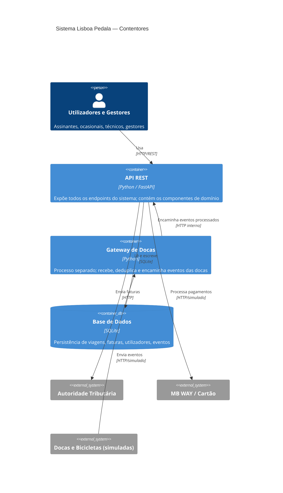

# C4 Nível 2 — Contentores

```mermaid
C4Container
    title Sistema Lisboa Pedala — Contentores

    Person(utilizador, "Utilizadores e Gestores", "Assinantes, ocasionais, técnicos, gestores")

    Container(api, "API REST", "Python / FastAPI", "Expõe todos os endpoints do sistema; contém os componentes de domínio")
    Container(gateway, "Gateway de Docas", "Python", "Processo separado; recebe, deduplica e encaminha eventos das docas")
    ContainerDb(db, "Base de Dados", "SQLite", "Persistência de viagens, faturas, utilizadores, eventos")

    System_Ext(at, "Autoridade Tributária")
    System_Ext(mbway, "MB WAY / Cartão")
    System_Ext(docas, "Docas e Bicicletas (simuladas)")

    Rel(utilizador, api, "Usa", "HTTP/REST")
    Rel(docas, gateway, "Envia eventos", "HTTP/simulado")
    Rel(gateway, api, "Encaminha eventos processados", "HTTP interno")
    Rel(api, db, "Lê e escreve", "SQLite")
    Rel(api, at, "Envia faturas", "HTTP")
    Rel(api, mbway, "Processa pagamentos", "HTTP/simulado")
```